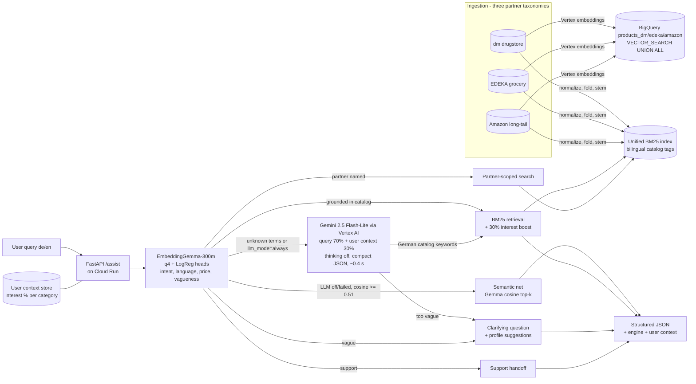

# PAYBACK Lightweight Assistant

[](https://github.com/niserson/payback-assistant/actions/workflows/ci.yml)

A lightweight microservice that takes a raw user query (German or English), detects
**intent** (`search` / `discovery` / `comparison` / `customer_support`) and **language**,
and returns a structured JSON response: either **recommended products** retrieved across
three partner ecosystems, a **clarifying question**, a **partner route**, or a
**support handoff**.

No hand-coded lexicons anywhere: query understanding is EmbeddingGemma-300m (q4
ONNX, torch-free, ~190 MB, benchmark-selected over E5/static/TF-IDF alternatives —
see `scripts/benchmark_*.py`) feeding logistic-regression heads trained from
synthetic labeled data at build time, plus pure-Python BM25 over the catalogs' own
bilingual tags and a confidence-gated cosine semantic net over the same embeddings. The module boundaries (`intent`,
`retrieval`, `agent`) are clean seams where an LLM or embedding model can be swapped
in later without touching the API contract.

**Hybrid understanding:** the deterministic path (Gemma encode + heads + BM25, ~100 ms
on 1 vCPU) answers everything it can;
only queries with no retrievable product term escalate to Gemini (Vertex AI on Cloud
Run, AI Studio locally), which translates the need into German catalog keywords or a
clarifying question — with silent fallback to the classifier if the LLM is unavailable. A
built-in chat UI is served at `/`.

## Quickstart (local, no Docker needed)

```bash
pip install -r requirements-dev.txt
python -m uvicorn app.main:app --port 8080     # start the API
python demo.py                                  # 5+ demo queries, in-process (no server needed)
python demo.py --url http://localhost:8080      # same, against the running server
python -m pytest -q                             # test suite
```

Example call:

```bash
curl -X POST http://localhost:8080/assist \
  -H "Content-Type: application/json" \
  -d '{"query": "Bitte zeige mir Angebote für günstige Windeln"}'
```

## Architecture



**How three disparate catalogs are indexed and queried simultaneously:** each partner
catalog is normalized into one shared product schema (`id, partner, name, brand,
category, price, unit, tags, popularity`) at ingestion and indexed into a **single**
inverted index with field weighting (name > brand/tags > category). A query is
tokenized, umlaut/digraph-folded and lightly stemmed, then scored with Okapi BM25
across **all** partners at once — cross-lingual matching comes from the catalogs'
own bilingual tags, and terms outside the catalog vocabulary escalate to the LLM — the
`partner` field is just a filter, applied only for navigational queries. Ranking
blends BM25 relevance (85%) with a global popularity prior (15%) and a low-price boost
when the query signals price sensitivity ("günstig", "cheap", "Angebote").

**Cold start** is solved structurally: ranking uses only the query context + global
priors — no user history exists anywhere in the system.

## API

| Endpoint | Method | Description |
|---|---|---|
| `/assist` | POST | `{"query": str, "max_results": int, "user_id": str}` → structured response |
| `/health` | GET | liveness + index size + LLM backend |
| `/partners` | GET | partner catalog metadata |
| `/taxonomy` | GET | per-partner category trees with product counts |
| `/architecture` | GET | architecture diagram (HTML + SVG) |
| `/demo-notebook` | GET | executed demo notebook (5 queries, JSON outputs) |
| `/performance-report` | GET | executed load-test notebook with measured cost per 1000 requests |
| `/docs` | GET | OpenAPI UI |

**User context:** every query updates a per-user interest profile (percentage per
category, from the categories of returned products). The profile carries a **30%
weight at two layers**: it is injected into the Gemini prompt (resolving vague queries
toward the user's dominant categories instead of clarifying), and retrieval multiplies
each product's score by `1 + 0.3 × interest-share` of its category (favored categories
win near-ties). Storage is in-process per instance with Cloud Run session affinity
keeping a user pinned to one instance (demo scope); `app/context.py` is the seam for
Firestore/Memorystore in production. See `/coldstart-notebook` for a live cold-start
vs. persona comparison. Rebuild the notebooks against a live deployment
with `python scripts/build_notebooks.py --base <url>`.

Response shape (see `app/schemas.py`):

```json
{
  "query": "...", "language": "de", "intent": "search", "confidence": 0.85,
  "action": {"type": "recommend", "detail": "..."},
  "partner_filter": null,
  "products": [{"id": "dm-001", "partner": "dm", "name": "Windeln ...", "price": 4.87, "score": 9.1, "...": "..."}],
  "clarifying_question": null,
  "latency_ms": 0.4
}
```

## Agent policy (Next Best Action)

| Detected | Action |
|---|---|
| Specific product need | `recommend` — cross-partner BM25 search |
| Vague need | `clarify` — question, plus interest-based suggestions when history exists |
| Partner mentioned (dm/EDEKA/Amazon) | `route_to_partner` — partner-scoped search |
| Comparison ("besser", "oder", "vs") | `compare` — side-by-side of top matches |
| Support ("Problem", "Punkte", "refund") | `support_handoff` |

## Docker

```bash
docker build -t payback-assistant .
docker run -p 8080:8080 payback-assistant
```

Image: `python:3.12-slim`, non-root user, catalog baked at build time, ~60 MB compressed.

## Cloud deployment (preferred services — deployed & verified)

`scripts/deploy_cloudrun.sh <project-id> [region]` builds via Cloud Build and deploys to
**Cloud Run** (1 vCPU / 512 MiB, scale-to-zero, max 3 instances, concurrency 80). The
service is stateless — the index is rebuilt from the baked catalog in <100 ms at
instance start — so horizontal scaling is trivial.

All three preferred services are exercised:

- **Cloud Run (API)** — hosts the container; serves the UI, `/assist`, `/docs`.
- **Vertex AI (model serving)** — in the cloud the LLM path calls Gemini through the
  Vertex AI endpoint, authenticated by the Cloud Run *service account* via the metadata
  server (`VERTEX_PROJECT` env var; no API keys deployed). Locally, set
  `GEMINI_API_KEY` to use AI Studio instead; with neither, the service runs classifier-only.
  Responses expose which path answered via the `engine` field
  (`classifier` vs `classifier+gemini-2.5-flash-lite@vertex-ai`).
- **BigQuery (vector search)** — `scripts/bigquery_vector_search.py --project <id> "<query>"`
  embeds all partner catalogs with Vertex AI `text-embedding-005`, loads them into
  `payback_assistant.products`, and runs a semantic `VECTOR_SEARCH` (cosine). Verified:
  the query *"Ich brauche etwas gegen wunden Po bei meinem Kleinkind"* — zero keyword
  overlap with any product — returns Feuchttücher/Windeln/Schnuller. This is the
  production-scale retrieval path; the serving API keeps in-memory BM25 + LLM term
  expansion, which is faster and cheaper at demo catalog size.

## Load test & cost

```bash
python -m uvicorn app.main:app --port 8080   # terminal 1
python loadtest.py --requests 500 --concurrency 20   # terminal 2
```

Reports throughput, p50/p95/p99 latency and estimated **cost per 1000 requests** on
Cloud Run request-based billing (vCPU + memory + per-request fee at the observed
throughput).

Measured on a single local uvicorn worker (Windows, 1000 requests, concurrency 20):

```
errors=0  throughput=364 req/s  p50=14.0ms  p95=20.7ms
est. Cloud Run cost per 1000 requests (1 vCPU / 512 MiB): ~$0.0005
```

(The p99 reflects one-time connection warm-up of the first client batch; steady-state
latency is the p50/p95 band.)

## Performance report

Latency was minimized by *removing* inference from the hot path rather than optimizing
it: intent detection is EmbeddingGemma embeddings + linear heads (~100 ms on 1 vCPU,
the embedding amortized across intent AND the semantic net) and retrieval is
BM25 over a pre-built in-memory inverted index (O(query terms × candidate postings)),
so end-to-end handler time is well under a millisecond and total response time is
dominated by HTTP overhead. Bilingual catalog tags plus algorithmic folding replace a
multilingual embedding model — the single biggest latency/cost win — while keeping
German↔English recall at this catalog size (verified by the evaluation harness). The index is built once at startup (not per request), the
catalog is baked into the image (no cold-start I/O), and the service is stateless so
Cloud Run can scale it horizontally with concurrency 80 per instance. If semantic
recall ever requires an LLM/embedding step, the plan is: cache embeddings offline in
BigQuery, keep BM25 as a first-stage retriever, and only re-rank the top-k — keeping
the p95 budget intact.

## Project layout

```
app/
  main.py       FastAPI app (endpoints, logging, error shielding)
  schemas.py    Pydantic contract
  catalog.py    synthetic 3-partner catalog (seeded, reproducible)
  retrieval.py  BM25 index over bilingual catalog tags, cold-start ranking
  intent.py     query understanding (learned classifier + index-grounded signals)
  intent_model.py  Gemma-embedding + LogReg heads (intent, language, price, vague)
  semantic.py   EmbeddingGemma q4 ONNX encoder, product matrix, cosine net
  agent.py      next-best-action policy
tests/          unit + e2e tests (pytest)
demo.py         5+ queries -> JSON output
loadtest.py     throughput/latency/cost measurement
Dockerfile      slim, non-root
scripts/        Cloud Run deployment
```

## Evaluation

`evaluation/` contains an offline harness: a deterministic synthetic dataset
(**320 labeled examples** across intents, languages and actions, generated from the
catalog via templates — also loaded to BigQuery as `payback_assistant.eval_examples`)
and a metrics runner. Ground-truth relevance is independent of the retriever (literal
tag/name match only), so the normalization + synonym layers earn their scores.

```bash
python -m evaluation.harness    # full report in <5s (deterministic classifier path)
```

Current results (EmbeddingGemma engine): intent 97.5%, language 100%, action 99.1%,
partner routing 100%, Hit@5 1.000, MRR@5 1.000, NDCG@5 0.993 (282 retrieval
examples); off-template paraphrase slice 90-100% vs 70% for the earlier TF-IDF
features. CI enforces
thresholds (≥95% accuracies, Hit@5 ≥ 0.95, NDCG@5 ≥ 0.90) on every push. Executed
walkthrough: `/evaluation-notebook` on the live service.

## Out of scope (deliberate demo boundaries)

- Full session information and semantic IDs (e.g. SASRec-style sequential recommenders).
- Product catalogue size is limited to what is meaningful within synthetic generation.
- Observability/logging beyond basic request logs.
- Online performance measurement on test/control groups, A/A tests, causal inference.
- User action feedback (clicks, views, impressions) — no full shopping portal or
  customer-journey data exists.

## Security & correctness notes

- Strict input validation (Pydantic, length-capped queries), no dynamic code paths.
- Errors are logged server-side and shielded from clients (opaque 500).
- Non-root container user; no secrets, no outbound calls, fully deterministic (seeded).
- Test suite covers language/intent classification, cross-lingual retrieval, partner
  scoping, agent policy branches, and input validation.
